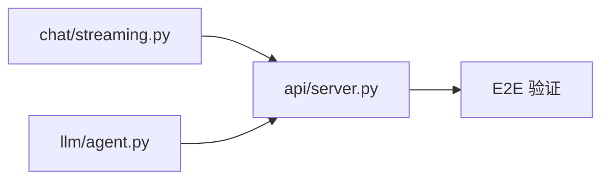

# 实现计划 — Web Chat UI (SSE 流式对话)

## Wave 1（并行，无依赖）

- [x] task-01: 新增 chat/streaming.py — SSE 流式 agent 封装
- [x] task-02: 修改 llm/agent.py — ChatOpenAI 加 streaming=True

## Wave 2（依赖 Wave 1）

- [x] task-03: 修改 api/server.py — 新增 /chat/stream 端点 + StaticFiles

## Wave 3（依赖 Wave 2）

- [x] task-04: 端到端流式对话验证

## 任务总表

| 编号 | 任务 | Wave | 优先级 | 估时 | 依赖 | 说明 |
|------|------|------|--------|------|------|------|
| task-01 | 新增 chat/streaming.py | W1 | P0 | 3h | — | SSE async generator，包装 agent.astream_events() |
| task-02 | 修改 llm/agent.py | W1 | P0 | 1h | — | ChatOpenAI 加 streaming=True，参数化 model |
| task-03 | 修改 api/server.py | W2 | P0 | 1h | task-01 | 新增 POST /chat/stream + StaticFiles mount |
| task-04 | 端到端验证 | W3 | P0 | 1h | task-01,02,03 | 启动服务，浏览器对话，curl 验证旧端点 |

## 依赖关系图

## 关键路径

task-01 → task-03 → task-04（3h，最长路径，瓶颈是 streaming.py 的 astream_events 适配）

## Spike 前置验证

| Spike | 验证内容 | 不通过后果 |
|-------|----------|------------|
| spike-01 | `DeepSeek ChatOpenAI(streaming=True)` 的 `astream_events()` 是否产出 `on_chat_model_stream` / `on_tool_start` / `on_tool_end` 事件 | 降级方案：非流式 tool calling + 仅流式输出最终文本 |

> task-01 开始前，优先执行 spike-01（10 分钟快速验证），避免写完 streaming.py 后发现事件格式不兼容。

## 全局验收标准

- [ ] 浏览器 `http://localhost:8000/` → 聊天 UI 正常渲染
- [ ] 输入电力问题 → SSE 流式逐字输出，Markdown 渲染正常
- [ ] 触发工具调用 → 黄色标签出现且完成后变绿
- [ ] 现有端点 (`/predict` `/simulate` `/backtest` `/explain`) 行为不变
- [ ] 未配置 DEEPSEEK_API_KEY 时 → SSE 返回友好 error 事件，不 crash
- [ ] `frontend-design` skill 产出的 index.html 与后端 SSE 事件协议对接正常
