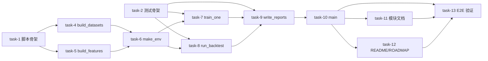

# 实现计划

## Spike 前置验证

无 Spike：sb3 PPO/SAC/TD3 + ElectricityMarketEnv 已在 `ellectric/scripts/run_demo.py` 与 `notebooks/09_rl_trading_agent.ipynb` 中验证可工作；本变更只是把已知组件串成一条可复现 CLI。技术不确定性集中在「50k×3 算法实际耗时」与「Tier4 weather cache 是否命中」，二者在执行期人工运行时确认即可，不需要前置 Spike。

## Wave 1（无依赖 — 基础设施 + 测试骨架）

- [x] task-1: 创建 `ellectric/scripts/train_rl_full_dataset.py` 骨架 + argparse + `--dry-run` 入口（覆盖：FR-06, D-004@v1, D-007@v1）
- [x] task-2: 新增 `tests/test_train_rl_full_dataset.py` 骨架 + fake `BaseRLAgent` adapter 夹具（覆盖：FR-07, D-007@v1）
- [x] task-3: 更新 `.gitignore` 忽略 `ellectric/reports/rl_full_dataset/*` / `models/rl_full_dataset/*` / `tb_logs/rl_full_dataset_*/`（覆盖：FR-08）

## Wave 2（依赖 Wave 1 — 数据/特征/环境装配）

- [x] task-4: 实现 `build_datasets` + rt_price→price_da 价格代理 + 时段切分 + null 填充（覆盖：FR-01, D-001@v1, D-006@v1）
- [x] task-5: 实现 `build_features` + Tier4 cache 降级 + forecasters 训练（覆盖：FR-02, D-006@v1）
- [x] task-6: 实现 `make_env` 工厂 + reward_fn="profit_only"（覆盖：FR-03, D-002@v1）

## Wave 3（依赖 Wave 2 — 训练 runner + 回测）

- [x] task-7: 实现 `train_one` + checkpoint 保存 + 单算法异常隔离（覆盖：FR-03, D-003@v1, D-005@v1）
- [x] task-8: 实现 `run_backtest` 6 条线对比 + Plotly 累计 P&L html（覆盖：FR-04, D-005@v1）

## Wave 4（依赖 Wave 3 — 报告 + main 串接）

- [x] task-9: 实现 `write_reports` JSON+MD + 原子写入 + 4 顶层字段 + train/test max_capacity（覆盖：FR-05, D-007@v1, D-008@v1）
- [x] task-10: 实现 `main()` 串接 Wave 1-4 + 退出码语义（覆盖：FR-06, D-004@v1）

## Wave 5（依赖 Wave 4 — 文档同步）

- [x] task-11: 更新 `docs/Ellectric/modules/rl-trainer.md` 增加「full-dataset 训练入口」章节（覆盖：FR-08）
- [x] task-12: 更新 `.planning/ROADMAP.md` + `ellectric/README.md` Phase 4 持续改进勾选 + 指向报告路径（覆盖：FR-08）

## Wave 6（依赖全部 — 端到端验证）

- [x] task-13: 运行 `pytest tests/test_train_rl_full_dataset.py` + `python -m ellectric.scripts.train_rl_full_dataset --dry-run` 全部通过（覆盖：FR-01~FR-08）

## 任务总表

| 编号 | 任务 | Wave | 优先级 | 依赖 | 覆盖 FR/D | 说明 |
|---|---|---|---|---|---|---|
| task-1 | 脚本骨架 + argparse + --dry-run | W1 | P0 | — | FR-06, D-004@v1, D-007@v1 | 先建空函数 + argparse 树，--dry-run 即可退出 0 |
| task-2 | 测试骨架 + fake adapter 夹具 | W1 | P0 | — | FR-07, D-007@v1 | TDD：先写测试，fake adapter 实现 BaseRLAgent 接口 |
| task-3 | .gitignore 忽略产物 | W1 | P0 | — | FR-08 | 报告 html/json/md、checkpoint zip、tb_logs |
| task-4 | build_datasets 价格代理 | W2 | P0 | task-1 | FR-01, D-001@v1, D-006@v1 | 切分 + rt_price→price_da + bfill().ffill() |
| task-5 | build_features Tier4 降级 | W2 | P0 | task-1 | FR-02, D-006@v1 | weather_source ∈ cache/fetch/degraded/skipped；训练 XGBoost+LEAR forecaster |
| task-6 | make_env 工厂 | W2 | P0 | task-4 | FR-03, D-002@v1 | reward_fn 固定 profit_only |
| task-7 | train_one + 异常隔离 | W3 | P0 | task-6 | FR-03, D-003@v1, D-005@v1 | try/except 包裹 sb3 .learn()，status=ok/error |
| task-8 | run_backtest 6 条线 | W3 | P0 | task-6 | FR-04, D-005@v1 | persistence/mean/oracle + 训练成功的 rl_ppo/rl_sac/rl_td3 |
| task-9 | write_reports JSON+MD | W4 | P0 | task-7,task-8 | FR-05, D-007@v1, D-008@v1 | metadata 双 max_capacity；tmp+rename 原子 |
| task-10 | main() 串接 + 退出码 | W4 | P0 | task-9 | FR-06, D-004@v1 | 0=ok, 1=数据/特征失败, 2=报告写入失败 |
| task-11 | rl-trainer.md 增章节 | W5 | P1 | task-10 | FR-08 | full-dataset 训练入口章节 |
| task-12 | README + ROADMAP 勾选 | W5 | P1 | task-10 | FR-08 | Phase 4 持续改进第 1 项勾选 + 报告路径 |
| task-13 | E2E 验证（pytest + --dry-run） | W6 | P0 | 全部 | FR-01~FR-08 | 不在 CI 跑 50k；人工本地 50k 训练为可选后续 |

## 关键路径

task-1 → task-4 → task-6 → task-7 → task-9 → task-10 → task-13（最长路径，决定本变更最短交付周期）

## 依赖关系图

## 调用点搜索记录

命令：`rg -n 'prepare_features|RLAgentFactory|ElectricityMarketEnv|BacktestRunner' --include='*.py' ellectric tests`

结论：
- 本变更不修改任何被调用的公开 API：`prepare_features`、`RLAgentFactory.create/load`、`ElectricityMarketEnv.__init__`、`BacktestRunner` 签名全部保持。
- 现有调用点（`run_demo.py`、`validate_weather_tier4.py`、`verify_time_resolution.py`、`service/handlers.py`、notebooks）不受影响。
- 新脚本 `train_rl_full_dataset.py` 仅作为新增 import 消费方加入；不进入 `service/handlers.py` 调用链。

## 全局验收标准

- [x] 所有 task-1~task-13 checkbox 勾选
- [x] `pytest tests/test_train_rl_full_dataset.py` 全部通过且测试中无真实 sb3 `.learn()` 调用
- [x] `python -m ellectric.scripts.train_rl_full_dataset --dry-run` 退出码 0
- [x] 产出 `ellectric/reports/rl_full_dataset/training_report.json` schema 含 4 顶层字段 + `metadata.price_proxy="rt_price->price_da"` + `metadata.reward_fn="profit_only"` + 双 max_capacity 字段
- [x] 旧调用点（`run_demo.py`、notebooks、`service/handlers.py`、`validate_weather_tier4.py`）行为不变（脚本仅 import；不改变现有 import）
- [x] README/ROADMAP/rl-trainer.md 不再出现「未跑过完整 96 维 RL」类旧表述
- [x] `.gitignore` 正确忽略 4 类产物（reports html/json/md、模型 zip、tb_logs、checkpoint）

## 覆盖矩阵

| 决策 ID | 覆盖任务 | 验收证据 |
|---|---|---|
| D-001@v1 价格代理 | task-4, task-9 | 报告 metadata.price_proxy 字段 + pytest 检查 price_da 列 |
| D-002@v1 profit_only | task-6, task-9 | make_env 固定 reward_fn + metadata.reward_fn 字段 |
| D-003@v1 单算法失败 | task-7, task-8 | pytest 异常路径 + report.training[algo].status="error" |
| D-004@v1 单脚本 | task-1, task-10 | 仅新增 `ellectric/scripts/train_rl_full_dataset.py`，不抽 pipeline 模块 |
| D-005@v1 50k+三基线 | task-7, task-8 | --timesteps 默认 50000 + 6 条线回测 |
| D-006@v1 切分+Tier1-4 | task-4, task-5 | 默认窗口 2024-01..2025-09/2025-10..2026-01 + tier4 默认 |
| D-007@v1 fake adapter | task-2, task-7, task-13 | pytest 不真调 sb3；--dry-run 不调 train |
| D-008@v1 双 max_capacity | task-9 | metadata.train_max_capacity_mw + test_max_capacity_mw |

## 自检结果

- [x] 每个 task 有编号（task-1~task-13）
- [x] 每个 task 在 Wave 下有 checkbox（`- [x] task-XX:` 格式）
- [x] 已标注 Wave 分组（W1-W6）和依赖
- [x] 任务总表含优先级 / 依赖列，无估时列
- [x] 关键路径标注
- [x] 全局验收标准 7 条具体可验
- [x] decisions.md 全部 D-001@v1~D-008@v1 在覆盖矩阵中
- [x] 无 P0/P1 unresolved blocker（Design Grill 已闭环）
- [x] 兼容性条款：旧调用点不变 + 旧 API 不动
- [x] 无函数签名/代码示例（接口定义在 design.md，不在 plan）
- [x] plan.md 与 design.md 文件变更清单一致（7 个文件）
- [x] 调用点搜索命令与结论已记录
- [x] Mermaid 图依赖关系非平凡（含 6 个节点 + 多个汇合点）
- [x] 无泛泛风险分析（R-01~R-09 已在 design.md，对应 task-7/task-9 验收）
