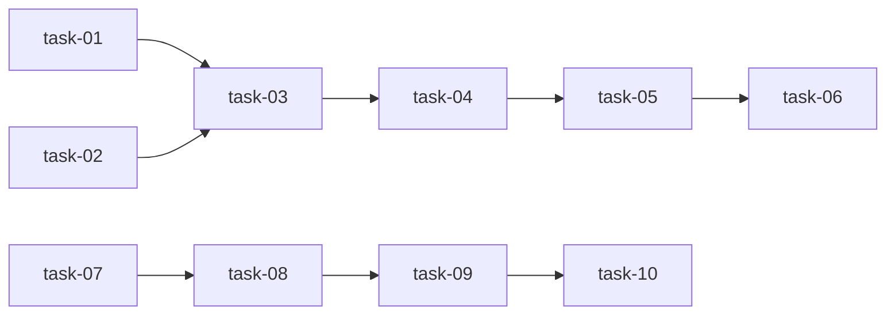

# 实现计划

## Wave 1: 核心模块（无依赖，可并行）

- [x] task-01: 创建 price_loader.py — 加载 ZionLuo xlsx
- [x] task-02: 创建 price_forecaster.py — LEARForecaster
- [x] task-07: 安装 ASSUME + 验证可运行

## Wave 2: 集成（依赖 Wave 1 模块）

- [x] task-03: 创建 06_price_forecasting.ipynb — 端到端 LEAR notebook
- [x] task-08: 创建中国省间市场 YAML 配置（3 个场景文件）

## Wave 3: 扩展（依赖 Wave 2 集成）

- [x] task-04: 搭建独立 epftoolbox venv + 下载基准数据集
- [x] task-09: 运行 ASSUME 7 天仿真 + 验证输出结果

## Wave 4: 分析（依赖 Wave 3 扩展）

- [x] task-05: 运行 DM/GW 统计检验，输出对比结果
- [x] task-10: 配置 Grafana 仪表板面板

## Wave 5: 交付（依赖 Wave 4 分析）

- [x] task-06: 创建 07_model_comparison_dashboard.ipynb — 3 Tab plotly 仪表板

## 任务总表

| 编号 | 任务 | Wave | 优先级 | 估时 | 依赖 | 文件 |
|------|------|------|--------|------|------|------|
| task-01 | 创建 price_loader.py | W1 | P0 | 2h | — | `ellectric/pipeline/price_loader.py` |
| task-02 | 创建 price_forecaster.py | W1 | P0 | 4h | — | `ellectric/pipeline/price_forecaster.py` |
| task-07 | 安装 ASSUME + 验证 | W1 | P0 | 1h | — | (脚本) |
| task-03 | 创建 06_price_forecasting.ipynb | W2 | P0 | 3h | task-01, task-02 | `ellectric/notebooks/06_price_forecasting.ipynb` |
| task-08 | 创建中国省间市场 YAML 配置 | W2 | P0 | 3h | task-07 | `ellectric/assume/configs/*.yaml` (3 个文件) |
| task-04 | 搭建 epftoolbox venv + 下载基准数据集 | W3 | P1 | 2h | task-03 | `ellectric/install_epftoolbox.sh` |
| task-09 | 运行 ASSUME 7 天仿真 | W3 | P0 | 3h | task-08 | (仿真输出) |
| task-05 | DM/GW 统计检验 | W4 | P1 | 2h | task-04 | (notebook cell) |
| task-10 | 配置 Grafana 仪表板 | W4 | P0 | 2h | task-09 | (Grafana JSON/docker-compose) |
| task-06 | 创建 07_model_comparison_dashboard.ipynb | W5 | P0 | 4h | task-05 | `ellectric/notebooks/07_model_comparison_dashboard.ipynb` |

### 优先级说明
- **P0** — 必须完成，Phase 2 成功标准核心
- **P1** — 重要，缺失不影响 Wave 完整性但影响教学效果

## 依赖关系图

## 关键路径

**预测路径**: task-01 → task-03 → task-04 → task-05 → task-06 (W1→W5, 14h 估时)
**仿真路径**: task-07 → task-08 → task-09 → task-10 (W1→W4, 9h 估时)
两条路径无交叉依赖，可在同一个 Wave 内交错执行。

## 全局验收标准

- [ ] `from ellectric.pipeline import PriceDataLoader, LEARForecaster` 可导入
- [ ] `PriceDataLoader().load_data()` 返回含 timestamp, price_da, load_mw 等 7 列的标准 DataFrame
- [ ] `LEARForecaster().train_evaluate()` 输出 MAE 指标，scaler fit-on-train-only
- [ ] 06 notebook 全部 cell 顺序执行无报错
- [ ] 07 notebook 3 个 Tab 渲染正常，hover 交互可用
- [ ] ASSUME 使用中国省间配置启动 7 天仿真完成
- [ ] Grafana 显示出清价格、调度量、利润面板
- [ ] Phase 1 代码无需任何修改
