# 实现计划: Phase 4 — Integration + LLM Interface

## Spike 前置验证

无技术不确定性。所有 pipeline 模块接口已明确（见 design.md §7 接口定义），Phase 4 仅为包装调用层，不涉及新算法、新协议或未经验证的集成。跳过。

## Wave 1（无依赖）

- [x] task-01: Phase 4 依赖声明 (`requirements-phase4.txt` + 追加到 `requirements.txt`)

## Wave 2（依赖 Wave 1）

- [x] task-02: Pydantic Schemas (`service/schemas.py`)

## Wave 3（依赖 Wave 2）

- [x] task-03: Handler 函数实现 (`service/handlers.py`)

## Wave 4（依赖 Wave 3，可并行）

- [x] task-04: FastAPI 服务 (`api/server.py`)
- [x] task-05: CLI 命令工具 (`cli/main.py`)

## Wave 5（依赖 Wave 4，可并行）

- [x] task-06: 端到端验证 (uvicorn 启动 + curl 测试 + CLI demo)
- [x] task-07: LangChain Tools (`llm/tools.py`)

## Wave 6（依赖 Wave 5）

- [x] task-08: LangChain Agent (`llm/agent.py`)

## Wave 7（依赖 Wave 6）

- [x] task-09: 交互式对话入口 (`llm/chat.py`)

## Wave 8（依赖 Wave 5 + Wave 7）

- [x] task-10: LLM 集成到 CLI (`cli/main.py` 追加 ask 命令)

## 任务总表

| 编号 | 任务 | Wave | 优先级 | 估时 | 依赖 | 说明 |
|------|------|------|--------|------|------|------|
| task-01 | Phase 4 依赖声明 | W1 | P0 | 0.5h | — | fastapi/uvicorn/typer/langchain/langchain-openai/httpx 版本 pin |
| task-02 | Pydantic Schemas | W2 | P0 | 2h | task-01 | ForecastRequest/Response 等 4 对 schema，含 Literal 枚举校验 |
| task-03 | Handler 函数实现 | W3 | P0 | 3h | task-02 | run_forecast/simulate/backtest/explain 4 函数 |
| task-04 | FastAPI 服务 | W4 | P0 | 2h | task-03 | 4 路由 + uvicorn 启动，Swagger 自动文档 |
| task-05 | CLI 命令工具 | W4 | P0 | 2h | task-03 | typer 4 命令 (forecast/simulate/backtest/explain) |
| task-06 | 端到端验证 | W5 | P0 | 1h | task-04,05 | 启动服务 + curl 测试 + CLI demo 全链路验证 |
| task-07 | LangChain Tools | W5 | P1 | 2h | task-04 | 3 个 @tool 函数，通过 httpx 调 FastAPI |
| task-08 | LangChain Agent | W6 | P1 | 1.5h | task-07 | Agent 初始化 + DeepSeek Chat API + 工具绑定 |
| task-09 | 交互式对话入口 | W7 | P1 | 1h | task-08 | 终端对话循环，`/exit` 退出 |
| task-10 | LLM 集成到 CLI | W8 | P1 | 1h | task-05,09 | `el-cli ask` 单次查询命令 (lazy import) |

> P1 标记 (task-07~10): LLM 为可选模块，W4 即可独立交付 API/CLI 核心功能。

## 依赖关系图

```mermaid
graph TD
  classDef w1 fill:#1e3a5f,stroke:#38bdf8
  classDef w2 fill:#2d1b69,stroke:#a78bfa
  classDef w4 fill:#1a3a1a,stroke:#4ade80
  classDef w5 fill:#3b1e1e,stroke:#f87171
  classDef w8 fill:#3a2a0a,stroke:#fbbf24

  task-01["W1: T-01 依赖声明"] --> task-02["W2: T-02 Schemas"]
  task-02 --> task-03["W3: T-03 Handlers"]
  task-03 --> task-04["W4: T-04 FastAPI"]
  task-03 --> task-05["W4: T-05 CLI"]
  task-04 --> task-06["W5: T-06 E2E验证"]
  task-05 --> task-06
  task-04 --> task-07["W5: T-07 LLM Tools"]
  task-07 --> task-08["W6: T-08 LLM Agent"]
  task-08 --> task-09["W7: T-09 Chat入口"]
  task-05 --> task-10["W8: T-10 CLI集成"]
  task-09 --> task-10

  class task-01 w1
  class task-02 w2
  class task-04,task-05 w4
  class task-06,task-07 w5
  class task-10 w8
```



## 关键路径

```
task-01 → task-02 → task-03 → task-04 → task-07 → task-08 → task-09 → task-10
```

总估时: ~13h。核心功能（API + CLI）在 W4 即可交付（task-04,05），LLM 模块（W5-W8）可后续独立推进。

## 全局验收标准

- [ ] `python -c "from ellectric.service.schemas import ForecastRequest; print(ForecastRequest)"` 不报错
- [ ] `uvicorn ellectric.api.server:app` 启动后 Swagger `/docs` 可访问
- [ ] `curl -X POST localhost:8000/predict -H "Content-Type: application/json" -d '{"model_type":"load","horizon":24}'` 返回 200
- [ ] `el-cli simulate summer_peak --days 7` 输出出清价格和代理利润
- [ ] `el-cli backtest 2022-08-01 2022-08-31 oracle` 输出 P&L 和策略对比
- [ ] `el-cli ask "预测负荷"` 返回自然语言回复 (需要 DEEPSEEK_API_KEY)
- [ ] `ellectric/pipeline/` 下文件无任何修改 (`git diff --stat` 验证)
- [ ] Phase 1-3 所有 notebook 导入路径不变
