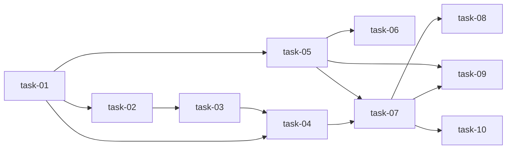

# 实现计划 — 中国电力数据更新

## Spike 前置验证

无需 Spike。技术方案确定（urllib + Parquet 缓存），无新技术栈风险。

## Wave 1: OWID 3 级回退 + 缓存（可独立交付）

- [x] task-01: 新增 OWID_CDN_URL 常量 + 修改 load_data() 回退链路
- [x] task-02: 新增 _fetch_from_url() 网络拉取方法
- [x] task-03: 新增 _load_from_cache() / _save_cache() 缓存方法
- [x] task-04: 验证 OWID 数据拉取到 2025 年

## Wave 2: Ember 数据加载器（依赖 Wave 1 的工厂模式确认）

- [x] task-05: 新增 EmberLoader(DataLoader) 类
- [x] task-06: create_loader() 注册 ember 源

## Wave 3: 文档 + 全管道验证（依赖 Wave 1+2）

- [x] task-07: 全管道 notebook 01→05 验证
- [x] task-08: 更新 README 数据源说明
- [x] task-09: 更新 INTEGRATIONS.md + _module-map.yaml
- [x] task-10: 新增 docs/data-sources.md

## 任务总表

| 编号 | 任务 | Wave | 优先级 | 估时 | 依赖 | 说明 |
|------|------|------|--------|------|------|------|
| task-01 | 新增 OWID_CDN_URL + 修改 load_data() | W1 | P0 | 2h | — | 核心回退链路 |
| task-02 | 新增 _fetch_from_url() | W1 | P0 | 1.5h | task-01 | 抽离网络拉取逻辑 |
| task-03 | 新增缓存方法 | W1 | P0 | 1.5h | task-02 | Parquet 读写 |
| task-04 | 验证 OWID 拉取到 2025 | W1 | P0 | 0.5h | task-01,02,03 | Jupyter 手动验证 |
| task-05 | 新增 EmberLoader(DataLoader) | W2 | P1 | 2h | task-01 | 继承 ABC，容错降级 |
| task-06 | create_loader 注册 ember | W2 | P1 | 0.5h | task-05 | 工厂扩展 |
| task-07 | notebook 01→05 全流程 | W3 | P0 | 1h | task-04,05 | 端到端 smoke test |
| task-08 | 更新 README | W3 | P1 | 0.5h | task-07 | 数据源说明 |
| task-09 | 更新 INTEGRATIONS + module-map | W3 | P1 | 0.5h | task-05 | Ember 条目 + ember-loader 模块 |
| task-10 | 新增 docs/data-sources.md | W3 | P2 | 0.5h | task-07 | 数据源一览 |

## 依赖关系图

## 关键路径

task-01 → task-02 → task-03 → task-04 → task-07 → task-08（最长路径，~6h）

## 全局验收标准

- [ ] `create_loader("owid").load_data()` 返回 2025 年数据
- [ ] CDN 不可用时自动回退到 GitHub raw（日志含 WARNING）
- [ ] 网络全断时从本地缓存加载（不抛异常）
- [ ] `create_loader("owid")` / `"manual"` / `"file"` 向后兼容，行为不变
- [ ] notebook 01→05 全流程跑通
- [ ] 文档新增数据源一览页
