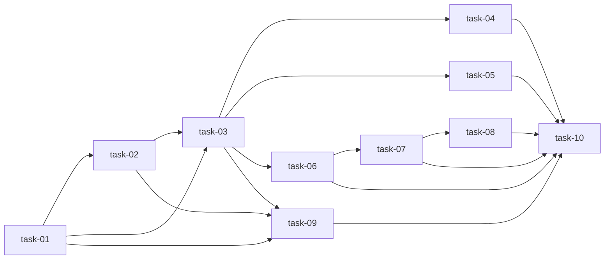

# 实现计划

## Wave 1（无依赖）

- [x] task-01: 新增 weather feature 契约测试（覆盖：FR-001, FR-002, FR-003, FR-004, D-006@v2, D-007@v2）

## Wave 2（依赖 task-01）

- [x] task-02: 修正 WeatherFetcher 15min 对齐边界（覆盖：FR-003, D-007@v2）

## Wave 3（依赖 task-01, task-02）

- [x] task-03: 实现 FeatureEngineer Tier4 weather + cache 集成（覆盖：FR-001, FR-002, FR-003, FR-004, D-006@v2, D-007@v2）

## Wave 4（依赖 task-03，并行）

- [x] task-04: 更新 feature-engineer 模块文档与 module-map（覆盖：FR-005, D-009@v1）
- [x] task-05: 更新 scan 架构文档旧事实（覆盖：FR-005, D-009@v1）
- [x] task-06: 更新 README、ROADMAP、REQUIREMENTS 状态（覆盖：FR-005, D-001@v1, D-002@v1, D-003@v1, D-004@v1, D-005@v1）

## Wave 5（依赖前序，并行）

- [x] task-07: 新增 LLM Wiki Phase 4 closeout synthesis（覆盖：FR-006, D-008@v1）
- [x] task-09: 运行代码测试与旧 API 兼容检查（覆盖：FR-001, FR-002, FR-003, FR-004）

## Wave 6（依赖 task-07）

- [x] task-08: 更新 LLM Wiki entity、历史 synthesis、index、log（覆盖：FR-006, D-008@v1）

## Wave 7（依赖全部）

- [x] task-10: 运行文档/wiki 对账检查并更新任务勾选（覆盖：FR-005, FR-006, D-001@v1~D-009@v1）

## 任务总表

| 编号 | 任务 | Wave | 优先级 | 依赖 | 覆盖 FR/D | 说明 |
|---|---|---|---|---|---|---|
| task-01 | 新增 weather feature 契约测试 | W1 | P0 | — | FR-001~FR-004, D-006@v2, D-007@v2 | 先写测试锁定 Tier4、cache、15min 对齐、降级、旧 API 兼容 |
| task-02 | 修正 WeatherFetcher 15min 对齐边界 | W2 | P0 | task-01 | FR-003, D-007@v2 | 解决 `tolerance="30min"` 漏 00:45 风险 |
| task-03 | 实现 FeatureEngineer Tier4 weather + cache | W3 | P0 | task-01, task-02 | FR-001~FR-004, D-006@v2, D-007@v2 | 实现可选 weather layer，不改变 Tier1-3 默认行为 |
| task-04 | 更新 feature-engineer 模块文档与 module-map | W4 | P1 | task-03 | FR-005, D-009@v1 | 文档记录 Tier4 与模块依赖 |
| task-05 | 更新 scan 架构文档旧事实 | W4 | P1 | task-03 | FR-005, D-009@v1 | 清理 scan 里的 OWID/hourly/Box(24) 当前事实 |
| task-06 | 更新 README、ROADMAP、REQUIREMENTS 状态 | W4 | P1 | task-03 | FR-005, D-001@v1~D-005@v1 | 统一 Phase 4 与 out-of-scope 口径 |
| task-07 | 新增 LLM Wiki closeout synthesis | W5 | P1 | task-06 | FR-006, D-008@v1 | 新增符合 schema 的 synthesis 页面 |
| task-09 | 运行代码测试与旧 API 兼容检查 | W5 | P0 | task-01, task-02, task-03 | FR-001~FR-004 | 验证代码行为与 TDD 目标 |
| task-08 | 更新 LLM Wiki entity/synthesis/index/log | W6 | P1 | task-07 | FR-006, D-008@v1 | 将新结论接入 wiki 链接与时间线 |
| task-10 | 运行文档/wiki 对账检查并更新任务勾选 | W7 | P0 | task-04~task-09 | FR-005, FR-006, D-001@v1~D-009@v1 | 最终确认文档、wiki、任务状态一致 |

## 依赖关系图

## 关键路径

task-01 → task-02 → task-03 → task-06 → task-07 → task-08 → task-10（最长路径）

## 调用点搜索记录

命令：`/usr/bin/rg -n 'prepare_features\(|get_feature_columns\(|FeatureEngineer\(|add_tier[123]_features\(' ellectric tests docs/Ellectric/modules .sillyspec/changes/2026-06-27-weather-and-roadmap-sync`

结论：
- `prepare_features()` 真实调用点仅在 `ellectric/pipeline/features.py` 示例与文档/spec 中，旧签名兼容由 task-01/task-03/task-09 覆盖。
- `FeatureEngineer` / `get_feature_columns` 下游调用点在 notebooks、scripts、service handlers、tests 中；task-03 必须保证 Tier1~Tier3 不变，task-09 必须运行旧 API 兼容测试。
- `price_forecaster.get_feature_columns()` 是独立类同名方法，不属于本轮代码修改范围。

## 全局验收标准

- [x] `tests/test_weather_features.py` 覆盖 Tier4、cache 命中、cache 缺失降级、15min safe ffill、旧 `prepare_features(df, tiers=...)` 兼容。
- [x] 不真实调用 Open-Meteo 的测试全部通过。
- [x] `prepare_features(df, tiers=["tier1"])` 与 Tier1~Tier3 旧调用行为不变。
- [x] `get_feature_columns("tier4")` 只返回实际存在的天气列，不包含缺失列。
- [x] `WeatherFetcher.align_to_15min()` 或 Tier4 对齐逻辑覆盖 `00:45` 边界。
- [~] README、ROADMAP、REQUIREMENTS、scan ARCHITECTURE、module docs 与当前山东 15min + Phase 4 状态一致。（R3: README features 标注仍为"3 层"）
- [x] LLM Wiki 新增/更新页面符合 `schema.md` frontmatter、wikilink、index、log 规则。
- [x] D-001@v1~D-005@v1、D-006@v2、D-007@v2、D-008@v1、D-009@v1 均有任务和验收证据覆盖。
- [x] local.yaml 已读取；若仍无启用 lint/test 命令，则使用 targeted pytest 与静态 grep 作为验证证据。

## 覆盖矩阵

| ID | 覆盖任务 | 验收证据 |
|---|---|---|
| D-001@v1 | task-06, task-10 | README/ROADMAP/REQUIREMENTS/wiki 记录不做准实时 |
| D-002@v1 | task-06, task-10 | 文档/wiki 记录中长期合约暂缓 |
| D-003@v1 | task-06, task-10 | 文档/wiki 保持单省山东 MVP 口径 |
| D-004@v1 | task-06, task-10 | 文档/wiki 保持学习原型、非真实交易口径 |
| D-005@v1 | task-01~task-10 | plan 全范围覆盖 weather 集成 + 文档/wiki 对账 |
| D-006@v2 | task-01, task-03, task-09 | Tier4 API 与 `prepare_features(df, tiers=...)` 兼容测试 |
| D-007@v2 | task-01, task-02, task-03, task-09 | cache 与 00:45 safe ffill 测试 |
| D-008@v1 | task-07, task-08, task-10 | wiki synthesis/entity/index/log schema 检查 |
| D-009@v1 | task-04, task-05, task-10 | module-map 与 scan ARCHITECTURE grep 检查 |
