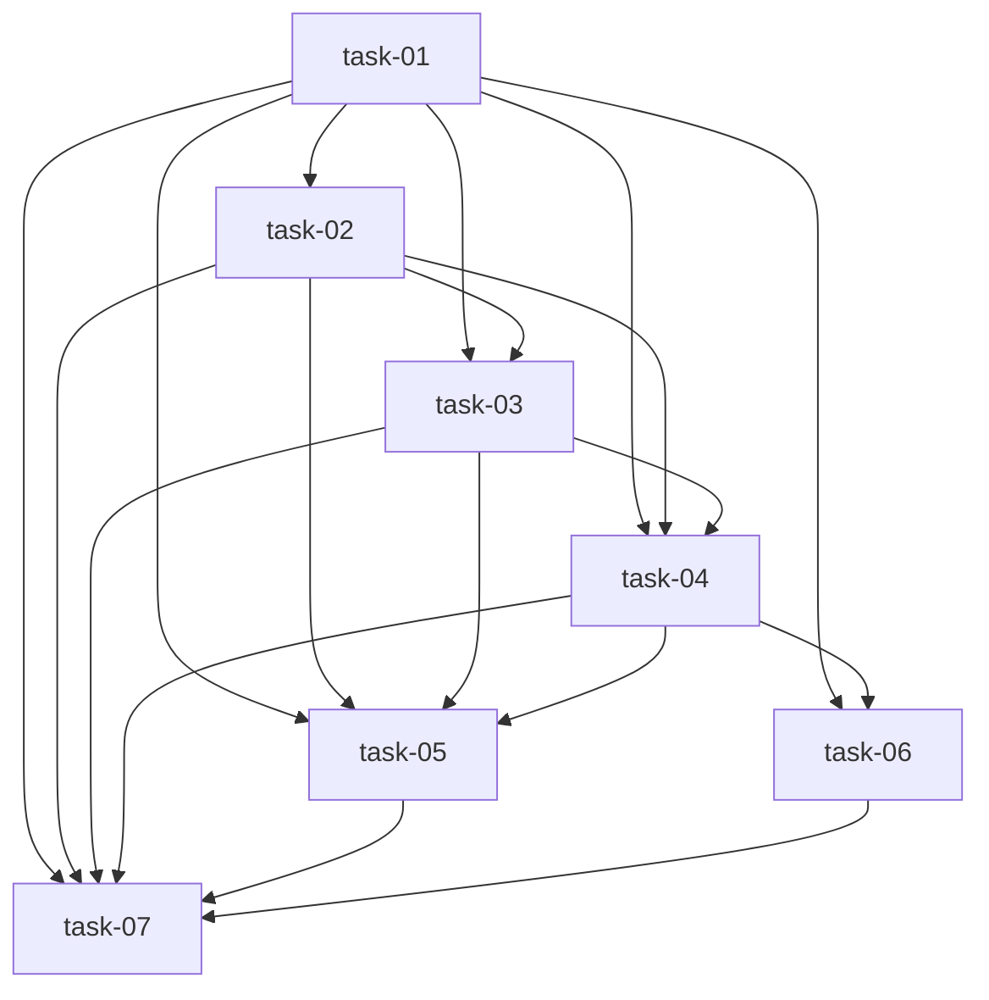

# 轻量计划：Weather Tier4 Validation

## 来源

来自 brainstorm 结论：采用方案B，新增可复现 Weather Tier4 验证脚本和 JSON/Markdown 报告；验证默认山东 15min 数据上的 weather 接入正确性与 baseline vs Tier4 指标变化；首轮报告式验证，不设硬性精度提升阈值。

## 范围

- `ellectric/scripts/validate_weather_tier4.py` — 新增验证脚本
- `tests/test_weather_tier4_validation.py` — 新增脚本测试
- `docs/Ellectric/modules/feature-engineer.md` — 更新模块文档
- `ellectric/reports/weather_tier4/weather_tier4_validation.json` — 脚本生成报告
- `ellectric/reports/weather_tier4/weather_tier4_validation.md` — 脚本生成报告
- 相关模块依赖：`feature-engineer` 依赖 `weather-fetcher`；验证脚本调用 `shandong-loader`、`feature-engineer`、`forecaster`

## Tasks / Wave 分组

### Wave 1（无依赖）

- [x] task-01: 新增 Weather Tier4 验证脚本骨架与 CLI 参数（覆盖：FR-01, FR-06, D-003@v1）

### Wave 2（依赖 Wave 1）

- [x] task-02: 实现 weather 来源解析与数据质量报告（覆盖：FR-02, FR-04, D-002@v1）

### Wave 3（依赖 Wave 1-2）

- [x] task-03: 实现 baseline_tier3 vs weather_tier4 对比实验与指标 delta（覆盖：FR-03, FR-04, D-001@v1, D-003@v1）

### Wave 4（依赖 Wave 1-3）

- [x] task-04: 实现 JSON 和 Markdown 报告输出（覆盖：FR-01, FR-05, D-001@v1, D-003@v1）

### Wave 5（依赖 Wave 4）

- [x] task-05: 新增验证脚本测试（覆盖：FR-02, FR-03, FR-04, FR-05, D-001@v1, D-002@v1, D-003@v1）
- [x] task-06: 更新 feature-engineer 模块文档（覆盖：FR-01, FR-05, D-003@v1）

### Wave 6（依赖 Wave 5）

- [x] task-07: 运行验证脚本、项目测试和检查命令（覆盖：FR-01, FR-02, FR-03, FR-04, FR-05, FR-06）

## 任务总表

| 编号 | 任务 | Wave | 优先级 | 依赖 | 覆盖 FR/D |
|---|---|---|---|---|---|
| task-01 | 新增 Weather Tier4 验证脚本骨架与 CLI 参数 | W1 | P0 | — | FR-01, FR-06, D-003@v1 |
| task-02 | 实现 weather 来源解析与数据质量报告 | W2 | P0 | task-01 | FR-02, FR-04, D-002@v1 |
| task-03 | 实现 baseline_tier3 vs weather_tier4 对比实验与指标 delta | W3 | P0 | task-01, task-02 | FR-03, FR-04, D-001@v1, D-003@v1 |
| task-04 | 实现 JSON 和 Markdown 报告输出 | W4 | P0 | task-01, task-02, task-03 | FR-01, FR-05, D-001@v1, D-003@v1 |
| task-05 | 新增验证脚本测试 | W5 | P0 | task-01, task-02, task-03, task-04 | FR-02, FR-03, FR-04, FR-05, D-001@v1, D-002@v1, D-003@v1 |
| task-06 | 更新 feature-engineer 模块文档 | W5 | P1 | task-01, task-04 | FR-01, FR-05, D-003@v1 |
| task-07 | 运行验证脚本、项目测试和检查命令 | W6 | P0 | task-01, task-02, task-03, task-04, task-05, task-06 | FR-01, FR-02, FR-03, FR-04, FR-05, FR-06, D-001@v1, D-002@v1, D-003@v1 |

## 依赖关系图

## 关键路径

task-01 → task-02 → task-03 → task-04 → task-05 → task-07（task-06 与 task-05 同 Wave 并行，均需在 task-07 前完成）。

## 验收

- AC-01: `python ellectric/scripts/validate_weather_tier4.py` 可运行，并生成 JSON/Markdown 报告。
- AC-02: JSON 报告包含 `metadata`、`weather_quality`、`experiments`、`interpretation` 四个顶层字段。
- AC-03: `weather_quality` 记录 weather_source、weather_features_available、weather_columns、missing_rate_by_column、overall_missing_rate、notes。
- AC-04: `experiments` 记录 baseline_tier3 与 weather_tier4 的 MAE、RMSE、MAPE、feature_count、input_rows、sample_count 和 delta。
- AC-05: weather 不可用或禁用 fetch 时，脚本输出 degraded 报告，不因 Tier4 缺失而失败。
- AC-06: 报告明确 `hard_threshold_applied=false`。
- AC-07: 新增测试覆盖报告 schema、降级路径和指标 delta，并与现有 Weather Tier4 契约测试一起通过。
- AC-08: 未修改 `FeatureEngineer`、`prepare_features`、`XGBoostForecaster` 的公开 API。
- AC-09: `docs/Ellectric/modules/feature-engineer.md` 记录验证脚本入口和报告产物。

## 覆盖矩阵

| ID | 覆盖任务 | 验收证据 |
|---|---|---|
| FR-01 | task-01, task-04, task-07 | AC-01, AC-02 |
| FR-02 | task-02, task-05, task-07 | AC-03, AC-05, AC-07 |
| FR-03 | task-03, task-05, task-07 | AC-04, AC-07 |
| FR-04 | task-02, task-03, task-05, task-07 | AC-05, AC-06, AC-07 |
| FR-05 | task-04, task-05, task-06 | AC-02, AC-07, AC-09 |
| FR-06 | task-01, task-07 | AC-08 |
| D-001@v1 | task-03, task-04, task-05 | AC-04, AC-06, AC-07 |
| D-002@v1 | task-02, task-05, task-07 | AC-03, AC-05, AC-08 |
| D-003@v1 | task-01, task-03, task-04, task-06 | AC-01, AC-02, AC-04, AC-09 |
