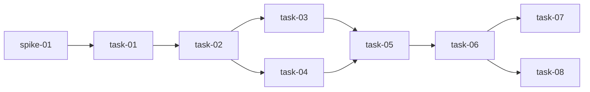

# 实现计划

## Spike 前置验证

| Spike | 验证内容 | 不通过后果 |
|---|---|---|
| spike-01 | 确认本机 Node/npm 可用，且 Vite 能构建到 `ellectric/api/static/` | task-01 调整为不依赖本地 npm 的静态产物方案，或回到 brainstorm 重选方案 A/B |

## Wave 1（前端骨架，无依赖）

- [x] task-01: 新增 Vite + React + TypeScript 前端工程骨架（覆盖：FR-007, FR-008, D-002@v2, D-005@v1）

## Wave 2（依赖 Wave 1）

- [x] task-02: 实现前端 API/SSE 类型与 fetch client（覆盖：FR-002, FR-004, FR-006, FR-009, FR-010, FR-013, D-004@v1, D-005@v1）

## Wave 3（依赖 Wave 2）

- [x] task-03: 实现 Dashboard-first 页面结构（覆盖：FR-001, FR-002, FR-003, FR-004, FR-005, FR-006, D-001@v1）
- [x] task-04: 迁移 Chat-first SSE UI 为右侧 Copilot（覆盖：FR-010, FR-013, D-001@v1, D-002@v2, D-004@v1, D-005@v1）
- [x] task-05: 落实非交易边界和风险文案（覆盖：FR-011, FR-012, D-003@v1）

## Wave 4（依赖 Wave 3）

- [x] task-06: 接入构建产物与 FastAPI 静态服务兼容验证（覆盖：FR-008, FR-009, D-002@v2, D-005@v1）

## Wave 5（依赖 Wave 4）

- [x] task-07: 更新 WebUI 使用文档（覆盖：FR-014, D-002@v2, D-005@v1）
- [x] task-08: 执行验证并记录结果（覆盖：FR-007, FR-008, FR-009, FR-010, FR-011, FR-013, D-002@v2, D-003@v1, D-004@v1, D-005@v1）

## 依赖关系图

## 任务总表

| 编号 | 任务 | Wave | 优先级 | 依赖 | 覆盖 FR/D | 说明 |
|---|---|---|---|---|---|---|
| task-01 | 新增 Vite + React + TypeScript 前端工程骨架 | W1 | P0 | spike-01 | FR-007, FR-008, D-002@v2, D-005@v1 | 建立前端源码和构建输出路径。 |
| task-02 | 实现前端 API/SSE 类型与 fetch client | W2 | P0 | task-01 | FR-002, FR-004, FR-006, FR-009, FR-010, FR-013, D-004@v1, D-005@v1 | 统一读取 catalog/report API 与 SSE 事件。 |
| task-03 | 实现 Dashboard-first 页面结构 | W3 | P0 | task-02 | FR-001, FR-002, FR-003, FR-004, FR-005, FR-006, D-001@v1 | 建立数据资产、价值链、预测、策略评估、解释和报告区域。 |
| task-04 | 迁移 Chat-first SSE UI 为右侧 Copilot | W3 | P0 | task-02 | FR-010, FR-013, D-001@v1, D-002@v2, D-004@v1, D-005@v1 | Copilot 复用现有 `/chat/stream` 协议。 |
| task-05 | 落实非交易边界和风险文案 | W3 | P0 | task-03, task-04 | FR-011, FR-012, D-003@v1 | 页面统一学习原型和策略评估口径。 |
| task-06 | 接入构建产物与 FastAPI 静态服务兼容验证 | W4 | P0 | task-05 | FR-008, FR-009, D-002@v2, D-005@v1 | 确认静态挂载不捕获 API 路由。 |
| task-07 | 更新 WebUI 使用文档 | W5 | P1 | task-06 | FR-014, D-002@v2, D-005@v1 | README 说明前端开发、构建和 FastAPI 服务方式。 |
| task-08 | 执行验证并记录结果 | W5 | P0 | task-06 | FR-007, FR-008, FR-009, FR-010, FR-011, FR-013, D-002@v2, D-003@v1, D-004@v1, D-005@v1 | 跑前端构建、API/SSE smoke、静态页面验证。 |

## 关键路径

spike-01 → task-01 → task-02 → task-03/task-04 → task-05 → task-06 → task-08

## 调用点搜索记录

| 搜索项 | 命令/证据 | 结论 |
|---|---|---|
| 既有前端构建基础 | `glob **/package.json`, `glob **/vite.config.*`, `glob **/tsconfig*.json` | 未发现现有 Node/Vite/TS 工程；task-01 新增。 |
| FastAPI 静态挂载 | `ellectric/api/server.py` | `StaticFiles("/")` 在 API 路由之后挂载；task-06 保持该顺序。 |
| Catalog/report schema | `ellectric/service/schemas.py`, `ellectric/service/catalog.py` | `ReportStatus` 支持 `ok/missing/error/degraded`；前端类型必须覆盖。 |
| SSE 事件协议 | `tests/test_chat_streaming_events.py` | 已有 `token/tool_call/tool_result/error/done` 协议测试；task-04 复用。 |

## 全局验收标准

- [x] `ellectric/web/` 前端构建成功，并生成 `ellectric/api/static/index.html`。
- [x] FastAPI `GET /` 返回 Dashboard 页面。
- [x] Legacy routes 仍注册：`/predict`, `/simulate`, `/backtest`, `/explain`, `/recommend`, `/chat/stream`, `/capabilities`, `/datasets`, `/reports`, `/reports/{report_id:path}`。
- [x] Catalog 路由仍在 `StaticFiles("/")` 之前注册，不被静态挂载捕获。
- [x] Copilot 仍能处理 `token/tool_call/tool_result/error/done` SSE 事件。
- [x] Dashboard 首屏展示山东数据、预测、策略评估、解释和报告溯源。
- [x] 页面交易相关文案只使用学习原型、策略评估、回测、假设分析、非交易建议等口径。
- [x] 缺报告、缺模型或缺 `DEEPSEEK_API_KEY` 时页面局部降级，不整页崩溃。
- [x] README 包含前端 dev/build、FastAPI 启动、构建产物位置和 API 兼容说明。
- [x] Brownfield 兼容：不改变既有 REST/SSE API 请求和响应语义。

## 覆盖矩阵

| ID | 覆盖任务 | 验收证据 |
|---|---|---|
| D-001@v1 | task-03, task-04 | Dashboard-first 首屏与 Copilot 位置检查。 |
| D-002@v2 | task-01, task-06, task-07, task-08 | 前端构建产物、FastAPI 静态服务、README。 |
| D-003@v1 | task-05, task-08 | 文案检查无真实交易/实盘/收益保证暗示。 |
| D-004@v1 | task-02, task-03, task-04, task-08 | 指标卡、报告卡和 tool_result 展示来源/status。 |
| D-005@v1 | task-01, task-02, task-06, task-07, task-08 | Legacy route smoke 和 SSE 事件测试。 |
| FR-001 | task-03 | `GET /` 页面主区域为 Dashboard。 |
| FR-002 | task-02, task-03 | `/datasets` 数据资产卡。 |
| FR-003 | task-03 | 端到端价值链区域。 |
| FR-004 | task-02, task-03 | Forecast Lab 能力卡和报告来源。 |
| FR-005 | task-03 | Strategy Evaluation 卡和状态降级。 |
| FR-006 | task-02, task-03 | Explainability 与 Reports/Data 卡。 |
| FR-007 | task-01, task-08 | 前端 build 成功。 |
| FR-008 | task-01, task-06, task-08 | FastAPI `GET /` 静态页面 smoke。 |
| FR-009 | task-02, task-06, task-08 | 旧 REST/SSE route table 检查。 |
| FR-010 | task-02, task-04, task-08 | SSE event parsing 和 Copilot 结果卡。 |
| FR-011 | task-05, task-08 | UI 文案检查。 |
| FR-012 | task-05 | 新增代码不含实盘/下单能力。 |
| FR-013 | task-02, task-04, task-08 | source/report/status 降级展示。 |
| FR-014 | task-07 | README WebUI 说明。 |

## 自检结果

- [x] 每个 task 有编号（task-01、task-02 ...）。
- [x] 每个 task 在 Wave 下有 checkbox（`- [ ] task-XX:` 格式）。
- [x] 已标注 Wave 分组和依赖关系。
- [x] 有任务总表（含优先级、依赖列，无估时列）。
- [x] 有关键路径标注。
- [x] 有全局验收标准。
- [x] 覆盖矩阵覆盖全部当前版本 D-xxx@vN 和 FR-xxx。
- [x] 不存在 P0/P1 unresolved blocker。
- [x] Brownfield 全局验收包含兼容性条款。
- [x] 未放函数实现或代码示例。
- [x] plan.md 与 design.md 文件变更清单一致。
- [x] 调用点搜索输出已记录。
- [x] Mermaid 图存在且依赖关系非平凡。
- [x] 没有泛泛风险分析。
