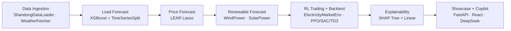

# ⚡ Ellectric — AI + 电力交易技术学习平台

[](https://www.python.org/)
[](LICENSE)
[]()

**Ellectric** 是一个动手实践性质的 AI + 电力交易技术学习项目。跑通"公开电力数据接入 → 负荷/电价预测 → 电力市场仿真 → 自动交易策略"的端到端技术闭环。

> 🔬 教育/学习用途，非生产系统。基于北京图迹科技技术画像，使用纯开源替代方案搭建可运行技术原型。

---

## 🎯 做了什么

从零构建了一个可完整运行的电力交易 AI 技术栈：

| 功能 | 技术实现 | 说明 |
|------|----------|------|
| **数据接入** | ShandongDataLoader + WeatherFetcher (Open-Meteo) | 山东 15min 现货数据 745 天 × 96 点 + 气象 12 列 |
| **数据清洗** | IQR 异常值检测 + 缺失填充 + UTC 标准化 | 异常值仅报告不删除 — 尖峰信号保留 |
| **特征工程** | 渐进式特征 (Tier 1→2→3→4) | 时间 → 周期编码 → 滚动统计 → 气象增强 |
| **负荷预测** | XGBoost + TimeSeriesSplit CV | 5 折时序交叉验证 (gap=24h) |
| **电价预测** | LEAR (Lasso L1) | Lasso 系数天然可解释 |
| **风光出力预测** | WindPowerForecaster + SolarPowerForecaster (XGBoost) | MAE/RMSE/nRMSE，气象可用时增强 |
| **RL 交易智能体** | PPO / SAC / TD3 | ElectricityMarketEnv (speculator spread)，Box 连续动作空间 |
| **历史回测** | BacktestRunner + 3 基线策略 | persistence/mean/oracle，夏普比率评估 |
| **模型可解释性** | SHAP TreeExplainer + LinearExplainer | waterfall + 特征重要性排名 |
| **统计检验** | Diebold-Mariano + Giacomini-White | 预测模型精度显著性检验 |
| **REST API** | FastAPI + Pydantic v2 | 5 端点 + SSE streaming |
| **CLI 工具** | Typer + Rich | 5 子命令 |
| **LLM 对话助手** | LangChain + DeepSeek API + SSE | 自然语言查询，工具调用 |
| **Dashboard-first WebUI** | Vite + React + TypeScript | Dashboard + Copilot 侧栏 |
| **学习 Notebooks** | 11 个渐进式 Jupyter notebooks | 零基础到 RL 智能体 |

> *ASSUME 0.6.0 曾作为独立学习实验探索（`ellectric/assume/` 脚本 + config），未进入集成管道。集成管道的"市场"环节由 `ElectricityMarketEnv` + `BacktestRunner` 承担。*

---

## 📊 项目历程

### 时间线

```
2026-05-20  ████████████████████████████  Phase 1: 数据基础 + XGBoost 负荷预测
            ├── 项目初始化、领域调研、路线图
            ├── OWID 数据自动拉取、清洗、特征工程
            ├── XGBoost 预测 + 持续法基线
            └── 5 个 Jupyter notebooks

2026-06-06  ████████████████████████████  Phase 2: 电价预测 + 风光出力预测
             ├── LEAR (Lasso) 日前电价预测
             ├── WindPowerForecaster + SolarPowerForecaster (XGBoost)
             ├── Diebold-Mariano/Giacomini-White 统计检验
             └── 2 个 notebooks + Grafana 仪表板

2026-06-07  ████████████████████████████  Phase 3: RL 交易智能体 + 回测
            ├── ElectricityMarketEnv (Gymnasium)
            ├── PPO/SAC/TD3 三种 RL 智能体
            ├── BacktestRunner + 3 基线策略
            ├── SHAP 模型可解释性
            └── 3 个 notebooks + 多轮 bug 修复

2026-06-08  ████████████████████████████  Phase 4: 集成 + LLM 接口
            ├── FastAPI REST API (5 端点)
            ├── Typer CLI (5 子命令)
            ├── LangChain + DeepSeek LLM 对话
            └── Service 层统一 API/CLI/LLM 三通道

2026-06-10  ████████████████████████████  数据更新 + Web Chat UI
            ├── OWID 数据更新至 2025 年
            ├── Ember 碳排放数据探索
            ├── SSE 流式 Web Chat UI
            └── OWID 三级回退链路 (GitHub → GCS → 缓存)
```

### 迭代统计

- **40 次提交**，涵盖 5 个开发阶段
- **约 2,400 行** Pipeline 核心代码（15 个模块）
- **约 1,200 行** 接口层代码（API + CLI + Service + LLM）
- **11 个** Jupyter Notebooks，从零基础到 RL 智能体
- **3 种** RL 算法 + **3 种** 基线策略 + **7 段** 集成管道
- **多轮密集 Bug 修复**：Phase 3 经历 7 轮修复（P&L 公式、SHAP 惰性导入、MultiInputPolicy、scaler 转换等）

---

## 🏗️ 架构

```
                        Interface Layer (三通道并行)
┌──────────────────┐  ┌──────────────────┐  ┌──────────────────────┐
│   FastAPI REST   │  │    Typer CLI     │  │  LangChain LLM       │
│  /predict        │  │  forecast        │  │  ask_agent(query)     │
│  /simulate       │  │  simulate        │  │   → DeepSeek API     │
│  /backtest       │  │  backtest        │  │   → 自然语言回答      │
│  /explain        │  │  explain         │  │                      │
│  /chat/stream    │  │  ask             │  │                      │
└────────┬─────────┘  └────────┬─────────┘  └───────────┬──────────┘
         └─────────────────────┼────────────────────────┘
                               │
                       Service Layer
              run_forecast() / run_simulate() /
              run_backtest() / run_explain()
                               │
                               ▼
┌──────────────────────────────────────────────────────────────────┐
│                       Pipeline Layer                              │
│                                                                    │
│  data_loader ──► cleaner ──► features ──► forecaster (XGBoost)   │
│       │                                        │                  │
│  price_loader ──► price_forecaster (LEAR)      │                  │
│       │                                        │                  │
│       └──────► backtester ◄── trading_env ◄────┘                  │
│                    │            │                                  │
│                    ▼            ▼                                  │
│              rl_trainer   shap_explainer                          │
│              (PPO/SAC/TD3) (Tree+Linear)                          │
└──────────────────────────────────────────────────────────────────┘
```

**关键设计原则**：
- **三明治架构**：API / CLI / LLM 三层并行，共享同一 Service 层，零重复逻辑
- **数据合约**：所有模块依赖统一的 `{timestamp, load_mw}` schema
- **延迟导入**：Service 层所有 pipeline 导入在函数内执行，避免循环依赖
- **可选依赖防护**：SHAP、epftoolbox、holidays 均 try/except 包裹，缺失时降级

---

## Pipeline Stages / 管道阶段

7-stage Integrated Pipeline:



| # | Stage | Tools | What It Does |
|---|-------|-------|-------------|
| ① | Data Ingestion | ShandongDataLoader, WeatherFetcher | 71,520 rows × 96 pts/day, 21 columns + 12 weather columns |
| ② | Load Forecasting | XGBoost, TimeSeriesSplit | 5-fold CV, gap=24h, MAE ~5,526 MW |
| ③ | Price Forecasting | LEAR (Lasso L1) | Day-ahead + real-time price, L1-regularized linear |
| ④ | Renewable Forecasting | WindPowerForecaster, SolarPowerForecaster (XGBoost) | Wind + solar MAE/RMSE/nRMSE |
| ⑤ | RL Trading + Backtest | ElectricityMarketEnv, BacktestRunner, PPO/SAC/TD3 | 3 agents, 3 baselines, speculator spread model |
| ⑥ | Explainability | SHAP (Tree + Linear) | Feature importance, waterfall charts |
| ⑦ | Showcase + Copilot | FastAPI, React, DeepSeek | Dashboard-first WebUI, SSE streaming, plain-language Q&A |

> ASSUME 0.6.0 仅作独立学习实验探索（`ellectric/assume/`），未接入集成管道。集成管道中"市场"由 ElectricityMarketEnv + BacktestRunner 实现。

## 🚀 快速开始

### 环境要求

- Python 3.11+
- Git

### 一键安装

```bash
# 在 ellectric 子目录下创建虚拟环境 .venv（不在仓库根目录混入）
(cd ellectric && chmod +x setup.sh && ./setup.sh)
```

脚本自动：检查 Python 版本 → 创建虚拟环境 → 安装所有依赖（国内网络自动使用清华镜像）

### 激活环境

```bash
source ellectric/.venv/bin/activate
```

> ⚠️ 必须从**仓库根目录**（`Electric/`）激活环境，之后所有命令也在根目录执行。
> 勿 `cd ellectric` 后再激活——Python 包导入会失败。

### 启动服务

```bash
# Install frontend dependencies and build
cd ellectric/web
npm install
npm run build          # → outputs to ellectric/api/static/

# Start the API (serves both API and built dashboard)
cd ../..
uvicorn ellectric.api.server:app --host 0.0.0.0 --port 8000
# 访问 http://localhost:8000 打开 Dashboard
# 访问 http://localhost:8000/docs 查看 API 文档

# CLI 命令
python -m ellectric.cli.main forecast load 24          # 负荷预测
python -m ellectric.cli.main simulate summer_peak --days 7  # 市场仿真
python -m ellectric.cli.main backtest 2022-08-01 2022-08-31 ppo  # 回测
python -m ellectric.cli.main explain xgboost 0           # SHAP 解释

# LLM 对话（需设置 DEEPSEEK_API_KEY）
python -m ellectric.cli.main ask "中国电力负荷有什么季节性特征？"

# 启动 Jupyter Notebooks
jupyter notebook ellectric/notebooks/
```

### Frontend 开发（热重载模式）

```bash
cd ellectric/web
npm run dev            # 启动 Vite 开发服务器（热重载，独立端口）
```

> `GET /` 返回 Dashboard 页面。所有已有 API 端点（`/predict`, `/simulate`, `/backtest`, `/explain`, `/chat/stream`）保持不变。前端构建产物输出至 `ellectric/api/static/`。前端本身是学习原型，不涉及真实交易或资金。

### Notebooks 学习顺序

| # | Notebook | 阶段 | 内容 |
|---|----------|------|------|
| 01 | `data_ingestion.ipynb` | Phase 1 | 从 OWID 自动获取中国电力数据 |
| 02 | `data_cleaning.ipynb` | Phase 1 | 缺失填充、异常值检测、时区标准化 |
| 03 | `feature_engineering.ipynb` | Phase 1 | 三层渐进式特征构建 |
| 04 | `load_forecasting.ipynb` | Phase 1 | XGBoost 训练评估 + 持续法基线 |
| 05 | `end_to_end_baseline.ipynb` | Phase 1 | 端到端管道 + P&L 模拟 |
| 06 | `price_forecasting.ipynb` | Phase 2 | LEAR Lasso 电价预测 |
| 07 | `model_comparison_dashboard.ipynb` | Phase 2 | 模型对比 + 统计检验 |
| 08 | `assume_results.ipynb` | Phase 2 | ASSUME 市场仿真分析（独立学习实验）|
| 09 | `rl_trading_agent.ipynb` | Phase 3 | RL 智能体训练 (PPO/SAC/TD3) |
| 10 | `multi_agent_backtest.ipynb` | Phase 3 | 多策略回测对比 |
| 11 | `model_explainability.ipynb` | Phase 3 | SHAP 特征重要性 + waterfall |

---

## 📁 项目结构

```
ellectric/
├── pipeline/              # 核心 ML 管道 (12 模块, ~2,400 行)
│   ├── data_loader.py     #   DataLoader ABC + OWID/Chinese/Ember loaders
│   ├── cleaner.py         #   数据清洗 + schema 验证
│   ├── features.py        #   FeatureEngineer (Tier 1→2→3)
│   ├── forecaster.py      #   XGBoost 负荷预测 + P&L 计算
│   ├── price_loader.py    #   电价数据加载 (ZionLuo dataset)
│   ├── price_forecaster.py #  LEAR Lasso 电价预测
│   ├── trading_env.py     #   Gymnasium 电力市场交易环境
│   ├── rl_trainer.py      #   BaseRLAgent ABC + PPO/SAC/TD3
│   ├── backtester.py      #   回测引擎 + 基线策略
│   ├── shap_explainer.py  #   SHAP TreeExplainer + LinearExplainer
│   ├── statistical_tests.py # Diebold-Mariano + Giacomini-White 检验
│   └── ember_loader.py    #   Ember 碳排放数据加载
├── api/
│   ├── server.py          #   FastAPI app (5 路由 + SSE streaming)
│   └── static/            #   Dashboard build output (from web/ npm run build)
├── web/                   # → Dashboard-first WebUI (Vite + React + TypeScript)
│   ├── package.json
│   ├── vite.config.ts
│   ├── tsconfig.json
│   ├── index.html
│   └── src/
│       ├── main.tsx
│       ├── App.tsx         # Dashboard + Copilot
│       ├── api.ts          # FastAPI client + SSE stream
│       ├── types.ts        # TypeScript type definitions
│       └── styles.css      # Dark theme, responsive
├── service/
│   ├── schemas.py         #   Pydantic v2 请求/响应模型
│   └── handlers.py        #   4 个业务 handler (API/CLI/LLM 共用)
├── cli/
│   └── main.py            #   Typer CLI (5 子命令)
├── llm/
│   ├── agent.py           #   LangChain + DeepSeek agent
│   ├── tools.py           #   @tool 函数 (httpx → FastAPI)
│   └── chat.py            #   终端对话入口
├── chat/
│   └── streaming.py       #   SSE 流式 agent 封装
├── assume/                #   ASSUME 仿真配置 + 脚本（独立学习实验）
├── notebooks/             #   11 个渐进式 Jupyter notebooks
├── data/                  #   数据文件 (.parquet, .xlsx, .joblib)
├── models/                #   训练好的模型文件
├── scripts/               #   验证/演示脚本
├── setup.sh               #   一键环境安装
├── requirements.txt       #   Python 依赖
└── docker-compose.yml     #   Grafana 仪表板 (ASSUME 独立学习实验用)
```

---

## 🛠️ 技术栈

| 层级 | 技术 | 用途 |
|------|------|------|
| 数据处理 | pandas 3.0.3 + pyarrow 22.0 | DataFrame 操作，Parquet 后端 |
| 机器学习 | scikit-learn 1.8 + xgboost 3.2 | 时序分割、XGBoost 回归 |
| 负荷预测 | XGBoost 3.2 + scikit-learn 1.8 | XGBoost 回归 + TimeSeriesSplit |
| 电价预测 | scikit-learn Lasso | LEAR 模型 (L1) |
| 风光出力预测 | XGBoost 3.2 | WindPowerForecaster + SolarPowerForecaster |
| 强化学习 | stable-baselines3 2.8 + gymnasium 1.2 | PPO/SAC/TD3 交易智能体 |
| 可解释性 | SHAP ≥0.46 | TreeExplainer + LinearExplainer |
| 统计检验 | epftoolbox | Diebold-Mariano + Giacomini-White |
| 气象特征 | Open-Meteo API | 济南/青岛 6 变量 × 2 城 = 12 列 |
| API | FastAPI + Pydantic v2 + uvicorn | REST + SSE streaming |
| CLI | Typer + Rich | 命令行工具 |
| LLM | LangChain + DeepSeek API | 自然语言对话助手 + 工具调用 |
| 可视化 | Plotly 6.7 | 交互式图表 |
| 开发 | Jupyter 1.1.1 | 渐进式学习 notebooks |

---

## 🔑 环境变量

| 变量 | 默认值 | 说明 |
|------|--------|------|
| `DEEPSEEK_API_KEY` | — | LLM Agent 所需（Phase 4） |
| `ELLECTRIC_API_URL` | `http://localhost:8000` | LLM tools 连接 API 地址 |
| `ELLECTRIC_MODEL_DIR` | `ellectric/models/` | 模型文件目录 |
| `ELLECTRIC_DATA_DIR` | `ellectric/data/` | 数据文件目录 |

---

## ⚠️ 注意事项

- **非生产系统**：所有模型和策略仅供学习参考，不构成交易建议
- **数据限制**：OWID 公开数据为年度级，需折算为日均值，精度有限
- **交易策略**：RL 交易智能体和 BacktestRunner 为简化市场场景（ElectricityMarketEnv），仅供学习参考，不构成交易建议
- **仅支持 Python 3.11+**

---

## 📄 License

本项目采用 [Ellectric Proprietary Source-Available License](LICENSE)：

- 允许查看源码，以及个人学习者下载未修改版本并在本人设备上非商业运行；
- 未经 `mechanic-Q` 事先书面许可，不得修改、分发、再许可、公开部署、向他人提供服务或商用；
- GitHub 公共仓库的查看与 Fork 仅适用 GitHub 服务条款所必需并允许的范围；
- 第三方软件、数据和模型继续适用各自的许可证与归属声明。

版权所有 © 2026 `mechanic-Q`。保留所有未明确授予的权利。
